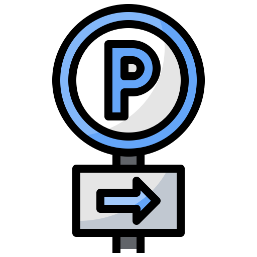

# Push Notifications plugin for Craft CMS 3.x

Web push notifications using firebase for Craft CMS

## Requirements

This plugin requires Craft CMS 3.4 or later.

## Installation

To install the plugin, follow these instructions.

1. Open your terminal and go to your Craft project:

        cd /path/to/project

2. Then tell Composer to load the plugin:

        composer require 24hoursmedia-craftcms/push-notifications

3. In the Control Panel, go to Settings → Plugins and click the “Install” button for Push Notifications.

## Push Notifications Overview

-Insert text here-

## Configuring Push Notifications

-Insert text here-

## Using Push Notifications

-Insert text here-

## Push Notifications Roadmap

Some things to do, and ideas for potential features:

* Release it

Brought to you by [24hoursmedia](https://www.24hoursmedia.com/en)
# push-notifications
